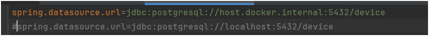
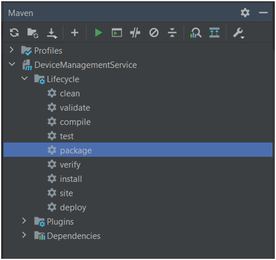

# DS2023_30643_Aurica_Alina_Assignment_3


## Introducere

Proiectul de față reprezintă o simulare a unei pagini web. Pagina web descrie un sistem asemănător celor de
gestiune a energiei într-o locuință, sistem care poartă denumirea de Energy Management System. Am utilizat ca
tehnologii: Java Spring pe partea de backend, Angular pe partea de frontend și PostgreSQL ca server de baze de
date. Pentru comunicarea și transferul de date între microservicii, precum și între Sensor Simulator și Monitoring
Service, am utilizat tehnologia RabbitMQ. Sistemul de notificari pentru depasirea consumului, precum și
componenta de chat sunt realizate prin intermediul WebSocket-urilor.
Există 2 tipuri de useri: client și admin. Adminul poate realiza operații pe CRUD pe cele 2 baze de date, să
asocieze unui device un client și să comunice cu clienții prin intermediul unui chat. Clientul poate să-și vizualizeze
device-urile, să primească notificări când consumul unui divece asociat i-a fost depășit, să poată vedea graficele cu
consumul pe oră (al fiecărui device) și să comunice cu admin-ul.
Pentru că securitatea este o parte importantă a acestui proiect, ea s-a realizat utilizând Spring Security și JWT
Token, pentru a se crea un sistem de autentificare-autorizare pentru fiecare microserviciu în parte.

## Build and run in IDE (Intellij IDE)

Pentru a putea rula dintr-un IDE (Intellij – presupunând că există Java jdk-17 pe device-ul respectiv), trebuie să:

- [ ] vă creați 4 baze de date în PostgreSQL cu numele corespunzătoare pe care le găsiți  în  [application.properties](...) (al fiecărui microserviciu);
- [ ] pentru partea de backend (microservicii) trebuie să comentați linia cu host.docker.internal și să o decomentați pe cea cu localhost (de la URL-ul database-ului) din [application.properties](...);


- [ ] există o linie similară și pentru configurarea de la RabbitMQ și se procedează similar;

- [ ] pentru frontend trebuie să aveți instalat Angular și jwt-decode;
```agsl
npm install -g @angular/cli
npm install jwt-decode

```
- [ ] deoarece utilizăm WebSocket, sunt necesare instalări pentru StompJS și SockJS:
```
npm install @stomp/stompjs
npm install sockjs-client
```
- [ ] dacă apar anumite erori, instalați pachetele sugerate (ex: ngModule);
- [ ] run simultan la toate cele 6 componente (backend-uri și frontend): click pe triunghiul verde din dreapta sus.


## Creere container de Docker pentru RabbitMQ

- [ ] se deschide Docker-ul;
- [ ] se introduc următoarele 2 comenzi în command line:
```
docker pull rabbitmq:3.10.5-management
docker run -d --name rabbitc1 -p 15672:15672 -p 5672:5672 -e RABBITMQ_DEFAULT_USER=alina -e RABBITMQ_DEFAULT_PASS=12345 rabbitmq:3.10.5-management
```


## Build and run in Docker 

- [ ] instalați Docker Desktop și faceți cont pe site;
- [ ] pentru a rula pe Docker e nevoie de pașii de la punctul anterior pentru a vă putea genera fișierul .jar
- [ ] din IDE - se intră în Maven, se selectează ca mai jos și se apasă pe run (click pe butonul verde de sus):



- [ ] din folderul target, se copiază denumirea fișierului .jar și se introduce în [Dockerfile](...) (se înlocuiește denumirea din path-urile cu fișierele .jar);
- [ ] se schimbă din nou în [application.properties](...) cum era inițial (prima poză) și se rulează în terminal: 
```
docker build –t <nume_container> .
```
- [ ] se intră în aplicația Docker Dekstop și la Image se ia numele imaginii și se adaugă în [docker-compose.yml](...);
- [ ] se rulează apoi comanda: 
```
  docker compose up –d
```
- [ ] aceleași 2 comenzi trebuie rulate și în terminalul de la frontend și pentru fiecare microserviciu în parte;
- [ ] se apasă pe run din Docker pt fiecare container în parte.


## Navigare pe pagina web

- [ ] pagina web se accesează prin: http://localhost:4200/firstPage;
- [ ] denumirea butoanelor sugerează ceea ce ar trebui făcut pe site, la fel și pop-up-urile primite de client.
